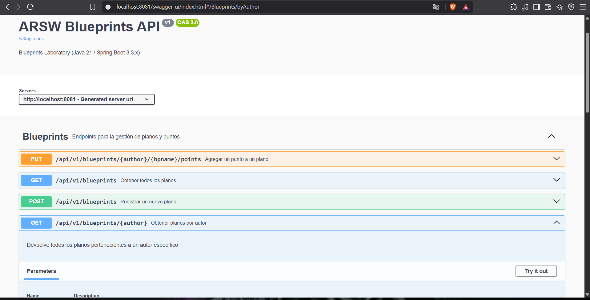
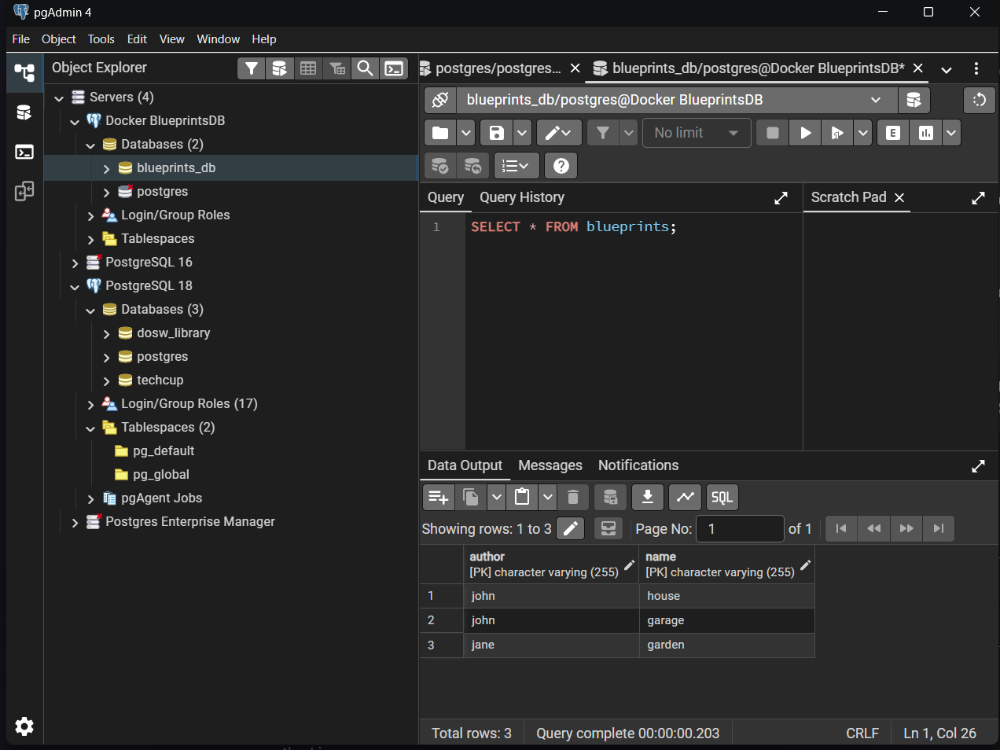
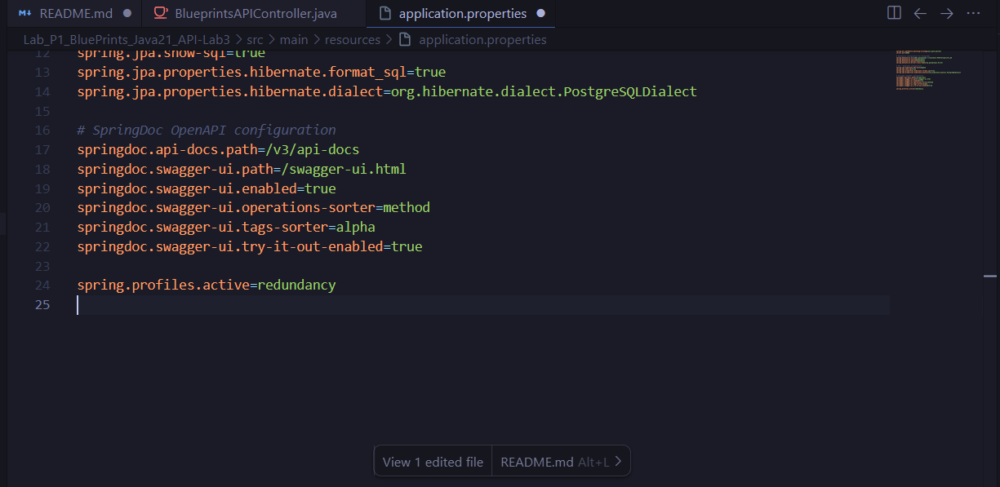
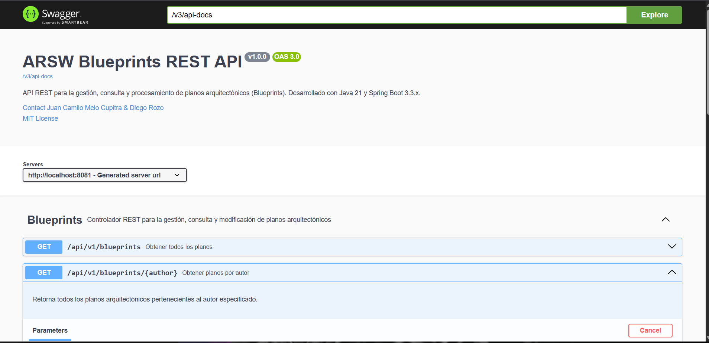
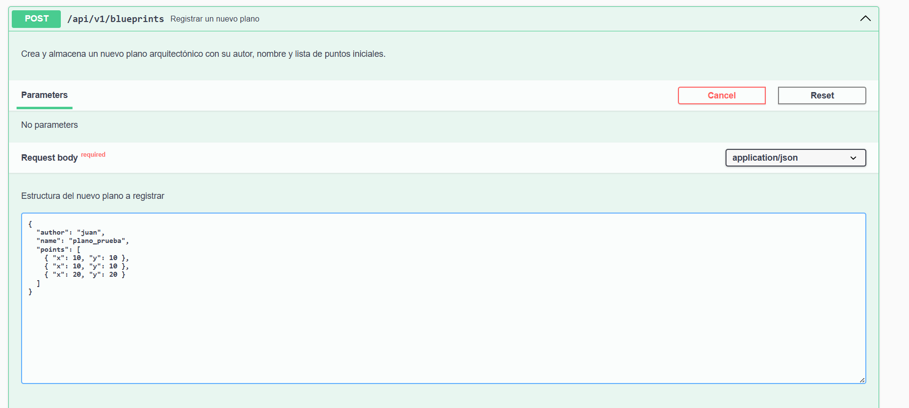
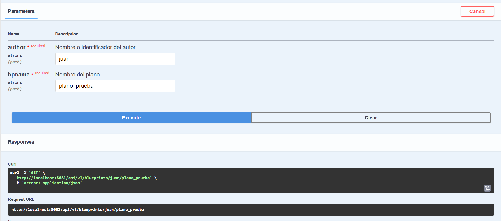
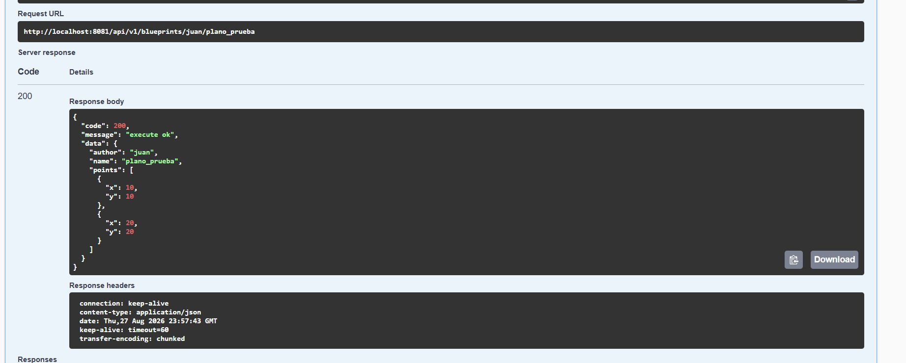

## Integrantes: Juan Camilo Melo cupitra - Diego Rozo
## Laboratorio #4 – REST API Blueprints (Java 21 / Spring Boot 3.3.x)
# Escuela Colombiana de Ingeniería – Arquitecturas de Software  

---

## 📋 Requisitos
- Java 21
- Maven 3.9+

## ▶️ Ejecución del proyecto
```bash
mvn clean install
mvn spring-boot:run
```
Probar con `curl`:
```bash
curl -s http://localhost:8080/api/v1/blueprints | jq
curl -s http://localhost:8080/api/v1/blueprints/john | jq
curl -s http://localhost:8080/api/v1/blueprints/john/house | jq
curl -i -X POST http://localhost:8080/api/v1/blueprints -H 'Content-Type: application/json' -d '{ "author":"john","name":"kitchen","points":[{"x":1,"y":1},{"x":2,"y":2}] }'
curl -i -X PUT  http://localhost:8080/api/v1/blueprints/john/kitchen/points -H 'Content-Type: application/json' -d '{ "x":3,"y":3 }'
```

> Si deseas activar filtros de puntos (reducción de redundancia, *undersampling*, etc.), implementa nuevas clases que implementen `BlueprintsFilter` y cámbialas por `IdentityFilter` con `@Primary` o usando configuración de Spring.
---

Abrir en navegador:  
- Swagger UI: [http://localhost:8080/swagger-ui.html](http://localhost:8080/swagger-ui.html)  
- OpenAPI JSON: [http://localhost:8080/v3/api-docs](http://localhost:8080/v3/api-docs)  

---

## 🗂️ Estructura de carpetas (arquitectura)

```
src/main/java/edu/eci/arsw/blueprints
  ├── model/         # Entidades de dominio: Blueprint, Point
  ├── persistence/   # Interfaz + repositorios (InMemory, Postgres)
  │    └── impl/     # Implementaciones concretas
  ├── services/      # Lógica de negocio y orquestación
  ├── filters/       # Filtros de procesamiento (Identity, Redundancy, Undersampling)
  ├── controllers/   # REST Controllers (BlueprintsAPIController)
  └── config/        # Configuración (Swagger/OpenAPI, etc.)
```

> Esta separación sigue el patrón **capas lógicas** (modelo, persistencia, servicios, controladores), facilitando la extensión hacia nuevas tecnologías o fuentes de datos.

---

## 📖 Actividades del laboratorio

### 1. Familiarización con el código base
- Revisa el paquete `model` con las clases `Blueprint` y `Point`.  
- Entiende la capa `persistence` con `InMemoryBlueprintPersistence`.  
- Analiza la capa `services` (`BlueprintsServices`) y el controlador `BlueprintsAPIController`.

### 2. Migración a persistencia en PostgreSQL
- Configura una base de datos PostgreSQL (puedes usar Docker).  
- Implementa un nuevo repositorio `PostgresBlueprintPersistence` que reemplace la versión en memoria.  
- Mantén el contrato de la interfaz `BlueprintPersistence`.  

### 3. Buenas prácticas de API REST
- Cambia el path base de los controladores a `/api/v1/blueprints`.  
- Usa **códigos HTTP** correctos:  
  - `200 OK` (consultas exitosas).  
  - `201 Created` (creación).  
  - `202 Accepted` (actualizaciones).  
  - `400 Bad Request` (datos inválidos).  
  - `404 Not Found` (recurso inexistente).  
- Implementa una clase genérica de respuesta uniforme:
  ```java
  public record ApiResponse<T>(int code, String message, T data) {}
  ```
  Ejemplo JSON:
  ```json
  {
    "code": 200,
    "message": "execute ok",
    "data": { "author": "john", "name": "house", "points": [...] }
  }
  ```

### 4. OpenAPI / Swagger
- Configura `springdoc-openapi` en el proyecto.  
- Expón documentación automática en `/swagger-ui.html`.  
- Anota endpoints con `@Operation` y `@ApiResponse`.

### 5. Filtros de *Blueprints*
- Implementa filtros:
  - **RedundancyFilter**: elimina puntos duplicados consecutivos.  
  - **UndersamplingFilter**: conserva 1 de cada 2 puntos.  
- Activa los filtros mediante perfiles de Spring (`redundancy`, `undersampling`).  

---

## ✅ Entregables

1. Repositorio en GitHub con:  
   - Código fuente actualizado.  
   - Configuración PostgreSQL (`application.yml` o script SQL).  
   - Swagger/OpenAPI habilitado.  
   - Clase `ApiResponse<T>` implementada.  

2. Documentación:  
   - Informe de laboratorio con instrucciones claras.  
   - Evidencia de consultas en Swagger UI y evidencia de mensajes en la base de datos.  
   - Breve explicación de buenas prácticas aplicadas.  

---

## 📊 Criterios de evaluación

| Criterio | Peso |
|----------|------|
| Diseño de API (versionamiento, DTOs, ApiResponse) | 25% |
| Migración a PostgreSQL (repositorio y persistencia correcta) | 25% |
| Uso correcto de códigos HTTP y control de errores | 20% |
| Documentación con OpenAPI/Swagger + README | 15% |
| Pruebas básicas (unitarias o de integración) | 15% |

**Bonus**:  

- Métricas con Actuator.  

---

## Informe de Laboratorio (Solución)

### 0. Instrucciones de Ejecución
Para evaluar y probar el proyecto correctamente, por favor sigue estos pasos:

1. **Levantar la Base de Datos:** Abre una terminal en la raíz del proyecto y ejecuta el contenedor de Docker para PostgreSQL:
   ```bash
   docker-compose up -d
   ```
2. **Ejecutar la Aplicación:** Una vez el contenedor esté corriendo, inicia la aplicación Spring Boot. Esto creará automáticamente las tablas en la base de datos:
   ```bash
   mvn spring-boot:run
   ```
3. **Probar con Swagger UI:** Ingresa a la interfaz interactiva de OpenAPI en tu navegador para realizar peticiones y consultar la documentación:
   - [http://localhost:8080/swagger-ui.html](http://localhost:8080/swagger-ui.html) *(Nota: Si el puerto 8080 está ocupado, la aplicación puede estar corriendo en el 8081).*
### 1. Buenas Prácticas de API REST Aplicadas
Durante el desarrollo de esta API, nos aseguramos de implementar los siguientes estándares y buenas prácticas:
- **Versionamiento de URL:** Se estableció la ruta base de los controladores como `/api/v1/blueprints` para permitir futuras evoluciones de la API sin romper la compatibilidad de los clientes actuales.
- **Códigos de Estado HTTP Semánticos:** Dependiendo del resultado de cada operación, el servidor responde con el código adecuado (ej: `201 Created` al crear un plano, `202 Accepted` al actualizar agregando un punto, `404 Not Found` cuando un recurso no existe, y `400 Bad Request` en caso de datos inválidos).
- **Envoltorio de Respuesta (ApiResponse):** Todas las respuestas de la API están encapsuladas en un DTO genérico `ApiResponse<T>`. Esto garantiza que los clientes consuman una estructura predecible (con los campos `code`, `message` y `data`), incluso en casos de error.
- **Manejo Global de Excepciones:** Se implementó un `@ControllerAdvice` (`GlobalExceptionHandler`) para interceptar errores y convertirlos en el formato de `ApiResponse` de forma limpia sin exponer el stack trace al cliente.

### 2. Migración a PostgreSQL y Docker
Se migró exitosamente la persistencia de datos (que originalmente residía en memoria) a una base de datos relacional PostgreSQL. Para esto:
- Se implementaron las entidades JPA `BlueprintEntity`, `BlueprintId` (para llave compuesta) y `PointEmbeddable`.
- Se reemplazó la implementación por `PostgresBlueprintPersistence` respetando estrictamente el contrato de la interfaz `BlueprintPersistence`.
- El despliegue de la base de datos se automatizó a través de un archivo `docker-compose.yml`.

### 3. Evidencias de Funcionamiento

**A) Evidencia de Consultas en Swagger UI / OpenAPI**


**B) Evidencia de Mensajes en la Base de Datos PostgreSQL**



### 4. Filtros de Blueprints
Se mantuvieron e integraron correctamente los filtros de procesamiento de puntos (`RedundancyFilter` y `UndersamplingFilter`), permitiendo modificar la densidad y redundancia de los planos según se requiera al consultar.

#### Prueba de Filtro: RedundancyFilter
A continuación, se detalla el proceso para verificar que el filtro de redundancia (eliminación de puntos duplicados consecutivos) funciona correctamente:

1. **Activar el filtro en configuración:** Se agregó la propiedad `spring.profiles.active=redundancy` en el archivo `application.properties` y se reinició la aplicación.
   
   

2. **Crear plano con puntos duplicados:** Mediante Swagger UI, se hizo un POST a `/api/v1/blueprints` creando un plano con puntos seguidos repetidos (ej: (10,10), (10,10), (20,20)).
   

3. **Consultar plano filtrado:** Al hacer un GET a `/api/v1/blueprints/{author}/{bpname}`, el servidor retorna el plano eliminando la redundancia (ej: retorna solo (10,10), (20,20)).
   
   